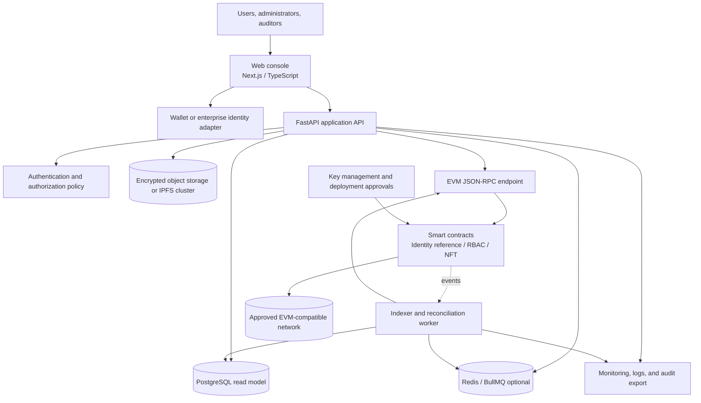
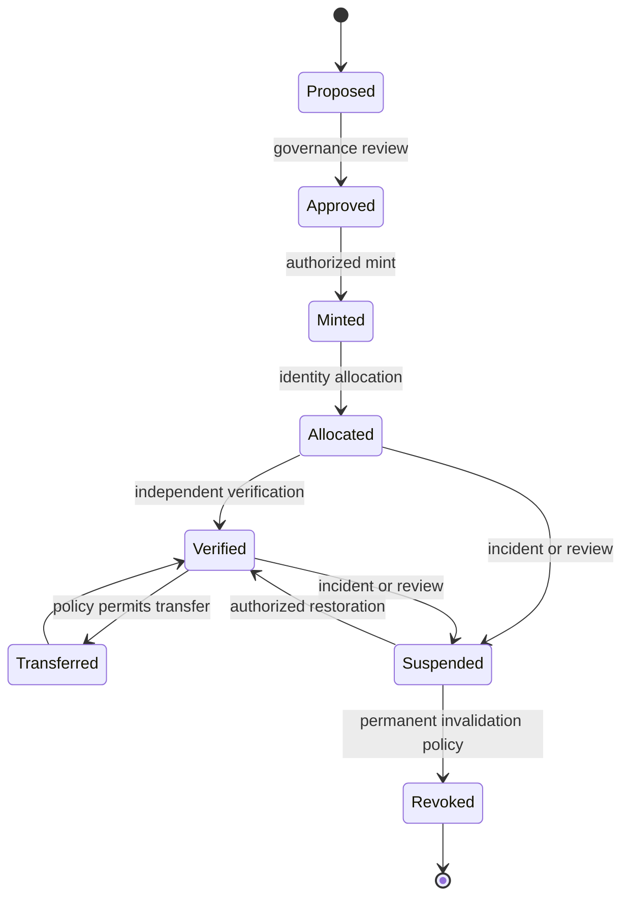

# Architecture

## Purpose and scope

This document defines the evolving architecture for the final-project execution of a platform that combines decentralized identity references, role-based access control (RBAC), NFT-backed digital-asset ownership, and an auditable event trail. It is an evidence-gated design baseline, not a final deployment specification or production approval. The target audience is Bharat Electronics Limited's technical and cybersecurity stakeholders, but the document does not assert institutional ownership, endorsement, authorization, or deployment approval. The maintained execution plan is [`docs/FINAL-PROJECT-COMPLETION-PLAN.md`](docs/FINAL-PROJECT-COMPLETION-PLAN.md), and the complete supplied-source ledger is [`docs/reference-ledger.md`](docs/reference-ledger.md).

The design follows a **canonical ledger plus recoverable projections** model. Smart contracts own the authoritative state transitions for roles, token ownership, and approved references. APIs, databases, indexes, queues, and object storage improve usability and query performance but must be rebuildable from approved source data.

## Architectural principles

1. **Least privilege:** Every state-changing operation has an explicit caller policy, and administrative authority is minimized and reviewable.
2. **Data minimization:** Sensitive identity and asset information remains off-chain unless a separate policy explicitly approves public or permissioned-chain storage.
3. **Independent verification:** A verifier can validate ownership and event history from the network, contract addresses, ABI, and approved metadata hashes without trusting the application UI.
4. **Fail closed:** Unknown roles, revoked identities, malformed inputs, stale projections, and unavailable authorization data must not grant access.
5. **Deterministic auditability:** State changes emit structured events with stable names, identifiers, and actor references while avoiding sensitive payloads.
6. **Recoverable off-chain services:** Indexers and databases are projections. Reconciliation and replay are designed from the beginning.
7. **Operational separation:** Contract proposal, review, approval, deployment, and key custody should be separated before a production gate.
8. **Accessibility and usability:** Security controls must remain understandable and operable for users with different abilities and environments.

## System context



## Component responsibilities

| Component | Responsibilities | Must not become the source of truth |
|---|---|---|
| Web console | Present identity, role, asset, verification, and audit workflows; request signed actions | Browser state, cached role labels, or client-supplied permissions |
| Wallet/identity adapter | Hold or access signing capability and produce user intent | Institutional identity assurance by itself |
| FastAPI API | Validate input, enforce application authorization, expose read/write workflows, and coordinate transactions | Canonical ownership or permission state when it conflicts with the chain |
| Identity service | Map approved application subjects to DID references and verification status | Raw identity documents or unrestricted claims |
| RBAC contract/module | Define roles and role administration, enforce permissions for contract operations, and emit role events | UI-only role checks |
| Asset NFT contract/module | Mint, allocate, transfer, and query unique asset tokens according to policy | Legal ownership or off-chain custody facts that are not represented in contract policy |
| Indexer | Consume events after the confirmation policy, build queryable projections, and reconcile drift | Permanent authority to rewrite history |
| PostgreSQL | Store projections, workflow state, metadata references, and operational records | Canonical token ownership or unrestricted identity records |
| Object storage / IPFS cluster | Store encrypted documents or metadata that are permitted off-chain; expose only approved content identifiers | Unencrypted secrets, public CIDs for confidential material, or unapproved personal data |
| Queue | Retry indexing and non-critical jobs with idempotency | Authorization decisions for sensitive writes |
| Deployment operator/KMS | Control deployment and privileged transaction signing under approved procedures | A single unmanaged long-lived private key |
| Monitoring/audit | Detect failures, export approved evidence, and alert operators | Raw secrets, private keys, or sensitive payloads |

## On-chain domain model

### Identity reference

The contract stores a stable subject reference and a unique DID-hash commitment, using wallet-based ECDSA/secp256k1 authentication for the EVM MVP. The address-to-DID-hash and DID-hash-to-address mappings prevent two active registry entries from claiming the same commitment, but they do not constitute a complete DID method. The contract should not store raw identity documents, credentials, biometric data, private contact details, or secrets. This is a blockchain-backed DID registry/reference, not a complete W3C SSI ecosystem. Verification methods, DID-document resolution, rotation, suspension, revocation, and recovery remain explicit lifecycle decisions.

### Roles and permissions

The default roles are `ADMIN`, `MANAGER`, `AUDITOR`, and `USER`. The contract should define the minimum authority needed to grant and revoke each role and whether roles are global, tenant-scoped, asset-scoped, or time-bounded. A role assignment should include an actor, subject, role, scope, effective status, and event metadata that does not disclose sensitive data.

### Asset tokens

Each asset token has a unique token identifier, a unique organizational asset ID such as `BEL-LAB-001`, a metadata hash, an identity reference or owner address, an explicit operational status, and lifecycle events. The MVP rejects duplicate asset IDs and uses ERC-721 for unique assets; ERC-1155 remains a future option for batches or semi-fungible licenses. Active assets may be accessed or transferred through policy; suspended, revoked, and retired assets remain auditable but are blocked from access and transfer. Physical ownership is not inferred from token ownership alone: a QR/NFC tag and organizational registration are required for physical-asset verification. The policy separates creation, allocation, access, transfer, lifecycle status, and emergency-recovery authority.

### Events

Events should be stable, documented, and sufficient for rebuilding projections. Representative events include `IdentityRegistered`, `IdentityUpdated`, `IdentityRevoked`, `RoleGranted`, `RoleRevoked`, `AssetMinted`, `AssetAllocated`, `AssetTransferred`, `AssetStatusChanged`, `AssetMetadataUpdated`, and `EmergencyStateChanged`. Event payloads should use identifiers and hashes rather than personal data.

## Trust boundaries and authorization

The API and frontend are untrusted relative to the contract. Client-provided role names, token owners, and permission flags must be treated as claims to validate, not facts to accept. The current MVP contract additionally overrides the inherited ERC-721 transfer entry points and checks active identity status so that `safeTransferFrom`, `transferFrom`, and the manager-authorized policy path do not silently bypass lifecycle rules. The API should verify the caller, the intended chain and contract, nonce or replay protections, and the expected state transition before submitting or reporting success.

For a privileged operation, the minimum flow is:

1. Authenticate the operator through the approved identity and signing method.
2. Resolve the current on-chain role and identity status.
3. Validate the request against application policy and contract preconditions.
4. Create a clear transaction preview containing target, method, parameters, network, and expected impact.
5. Require the appropriate signer or multi-party approval.
6. Submit the transaction and wait for the approved confirmation policy.
7. Confirm the resulting event and state before updating the user-facing operation status.
8. Reconcile the indexer projection and record an operational audit entry without copying secrets or sensitive payloads.

## Data classification and placement

| Data class | Examples | Default placement | Controls |
|---|---|---|---|
| Public technical metadata | Contract ABI, deployment network, public token identifier, content hash | Repository or chain | Integrity review and versioning |
| Restricted operational data | Internal asset labels, workflow state, audit export references | Encrypted off-chain storage | RBAC, encryption, retention, access review |
| Sensitive identity data | Documents, biometric data, personal contact data, credentials | Approved encrypted system outside the chain | Data minimization, consent/legal basis, strict retention, deletion process |
| Secret material | Private keys, seed phrases, tokens, KMS credentials | Hardware-backed or managed secret store | Never commit, log, export, or place in client code |

Hashing sensitive data is not automatically privacy-preserving if the source can be recovered or linked. For the prototype, encrypt each permitted asset payload with an AES-256 data-encryption key before storing it in IPFS or approved object storage; anchor the resulting CID or approved content reference on-chain. A CID is a content identifier containing content-addressing information and a multihash, not simply a SHA-256 file hash. Protect the data-encryption key through controlled wrapping/access logic; production may integrate an enterprise KMS/HSM. Blockchain authorization cannot prevent copying after decryption, so production environments may require endpoint controls or DLP. The project must document retention, erasure, revocation, subject rights, legal review, and chain immutability tradeoffs before using real identity data.

## Ownership and access are separate

NFT ownership identifies the current token owner and provides provenance. It does not by itself grant permission to read, use, download, or administer the underlying asset. The access layer evaluates the requester, active identity, RBAC role, asset status, asset policy, and approval state. Managers can set an auditable per-asset/per-action requester rule with an allow/deny value and optional expiry; absent rules use the bounded MVP fallback for owners, managers, and auditors. The MVP records explicit `AccessDecision` events with `GRANTED` or `DENIED` outcomes without relying on reverted transactions to persist failed-access logs. A future policy service must extend this baseline with tenant scope, delegation, reason codes, policy versions, and revocation workflows.

## Asset lifecycle



The lifecycle is conceptual. The legal status of a token, physical possession of an asset, and operational authorization to access a system may remain distinct. The project must not imply that an NFT alone establishes legal title.

## Operational flows

### Write path

The web console asks the API for a transaction preview. The API validates the request against current projected and canonical state, then the approved signer submits the transaction. The API records a pending operation, waits for the confirmation policy, verifies the event, and exposes the final state. If the transaction is reverted or the indexer is delayed, the operation remains visibly pending or failed rather than appearing successful.

### Read path

The UI reads from the API for search and workflow context. The API reads projections for speed and queries the chain when canonical confirmation is necessary. Critical verification views should expose contract address, network, token identifier, block reference, and metadata hash so an auditor can independently reproduce the result.

### Indexing and reconciliation

The indexer consumes contract events after the selected confirmation threshold, writes idempotent projections, and records the last processed block and transaction. It retries transient failures, detects gaps, and reconciles projections with canonical contract state. A chain reorganization policy must define when events are considered final and how to correct projections.

## Failure and recovery considerations

| Failure | Safe behavior | Recovery evidence |
|---|---|---|
| RPC outage | Reject or queue writes; show reads as stale | RPC health, pending transactions, and retry log |
| Indexer outage | Preserve chain state; mark projections stale | Last processed block and replay result |
| Database loss | Rebuild from approved migrations and chain events | Backup restore and reconciliation report |
| Object-storage outage | Do not mint references to unavailable metadata | Object version and integrity check |
| Signer compromise | Revoke/rotate role, pause affected operations, preserve evidence | Incident record and key-rotation proof |
| Contract defect | Pause if supported, coordinate operator action, publish status | Advisory, fixed version, migration/rollback procedure |
| Chain reorganization | Delay finality, replay affected range, flag uncertain state | Confirmation policy and reconciliation log |

## Observability and audit

Log the operation identifier, service component, chain/network, contract, transaction hash, result, latency, and correlation identifier. Do not log private keys, authorization headers, seed phrases, raw identity documents, or unnecessary personal data. Metrics should cover transaction success and revert rates, indexing lag, reconciliation drift, queue retries, authentication failures, and permission-denied events.

## Deployment boundaries

Local development uses a disposable blockchain network and test accounts. The proposal's Hyperledger Fabric, private Polygon, and other permissioned-EVM options remain network-strategy candidates rather than selected deployments. The deployment script enforces the environment policy, rejects non-local environments until an explicit network approval is recorded, verifies the connected chain ID and deployed bytecode, and writes a manifest containing the contract address, chain identity, compiler/optimizer/EVM settings, bytecode hash, ABI hash, source commit, deployer, custody declaration, and timestamp. Testnet deployment requires approved contracts, reproducible scripts, verified artifacts, operator runbooks, and monitoring. Production deployment additionally requires organizational ownership, network and custody approval, independent security review, privacy and legal review, incident response, backup/recovery, and a rollback or emergency procedure that does not assume immutable state can be erased.

## Repository structure

```text
.
├── apps/web/                         # Next.js frontend, not yet implemented
├── contracts/                        # Solidity contracts and deployment scripts
│   ├── SecureAssetPlatform.sol       # Executable MVP identity/RBAC/NFT baseline
│   ├── test/                         # Contract behavior and negative tests
│   └── scripts/                      # Local operations and guarded deployment
├── services/api/                     # FastAPI service
│   ├── app/                          # Routes, services, policies, models
│   └── tests/                        # API and authorization tests
├── services/indexer/                 # Event consumer and reconciliation
├── packages/types/                   # Shared schemas and generated types
├── packages/ui/                      # Accessible shared UI components
├── docs/ADR/                         # Architecture Decision Records
├── docs/COMPLIANCE-REPORT.md         # Problem-statement and production-gate status
├── docs/PROBLEM-STATEMENT-TRACEABILITY.md
├── docs/THREAT-MODEL.md              # Abuse cases, invariants, and controls
├── docs/ACCEPTANCE-CRITERIA.md       # Demonstrable MVP outcomes
├── docs/runbooks/                    # Deployment, incident, backup, and recovery
├── .github/                          # Workflows, issue forms, ownership, automation
└── .devcontainer/                    # Reproducible developer environment
```

## Open architectural decisions

The MVP decisions are: Solidity/Hardhat/OpenZeppelin, local EVM, ECDSA/secp256k1 wallet authentication, ERC-721 unique assets, fixed-size asset and metadata hashes, explicit manager-only transfers, disabled standard approvals, and a pause mechanism. Production decisions remain open for DID method/credential format, mobile-wallet protocol, permissioned network selection, multisig/KMS custody, confirmation/reorganization policy, encrypted IPFS pinning and key lifecycle, tenant isolation, legal meaning of asset ownership, API/indexer implementation, and whether the database layer uses Prisma behind a TypeScript indexer or a Python-native alternative such as SQLAlchemy/Alembic.

## Curated reference inputs

The 15 supplied SSI, DID, IAM, NFT, encrypted-storage, and permissioned-ledger repositories are cataloged in [`docs/REFERENCED-REPOSITORIES.md`](docs/REFERENCED-REPOSITORIES.md), mapped to original adoption decisions in [`docs/REFERENCE-INTEGRATION.md`](docs/REFERENCE-INTEGRATION.md), and bounded by [`THIRD-PARTY-NOTICES.md`](THIRD-PARTY-NOTICES.md). The complete 96-source utilization ledger is [`docs/reference-ledger.md`](docs/reference-ledger.md). The current architecture adopts OpenZeppelin as a runtime dependency and treats the other repositories and expanded tooling references as patterns, comparisons, local-test candidates, or future-gated inputs until separately approved under ADR 0008.

## References

[1]: https://www.w3.org/TR/did-core/ "W3C Decentralized Identifiers (DIDs) v1.0"
[2]: https://eips.ethereum.org/EIPS/eip-721 "ERC-721: Non-Fungible Token Standard"
[3]: https://docs.openzeppelin.com/contracts/ "OpenZeppelin Contracts documentation"
[4]: https://12factor.net/config "The Twelve-Factor App: Config"
[5]: https://owasp.org/www-project-application-security-verification-standard/ "OWASP Application Security Verification Standard"
[6]: https://ipfs.tech/ "IPFS documentation and project site"
[7]: https://eips.ethereum.org/EIPS/eip-1155 "ERC-1155 Multi Token Standard"
