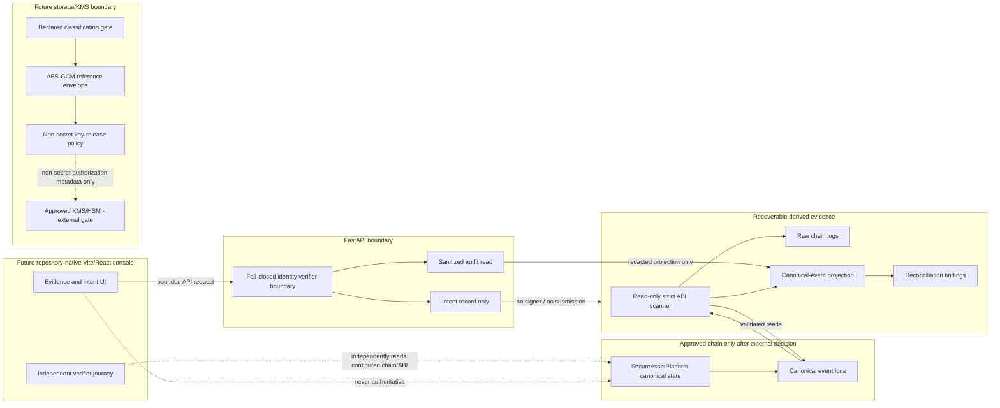
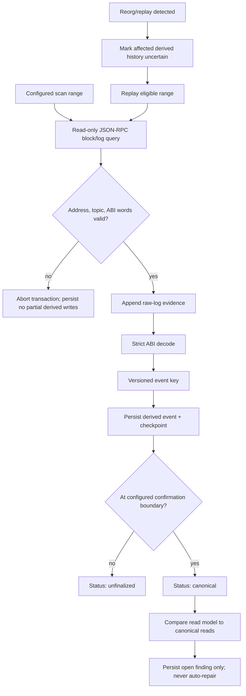

# Final Project Architecture Diagrams

> These Mermaid diagrams are **design and evidence artifacts**, not network approval, deployment evidence, a privacy determination, or a production architecture claim. The canonical authority, data placement, and external gates are defined by the [data dictionary](FINAL-PROJECT-DATA-DICTIONARY.md), [decision register](FINAL-PROJECT-DECISION-REGISTER.md), and [ADR 0007](ADR/0007-canonical-event-and-projection-schema.md).

## Authority and data-flow boundary



## Canonical-event recovery and uncertainty treatment



## Intent, chain outcome, and key-release non-authority boundaries

```mermaid
sequenceDiagram
    participant Caller as Verified caller (future)
    participant API as FastAPI
    participant DB as Intent/projection store
    participant Chain as Canonical contract
    participant KMS as Future approved KMS/HSM

    Caller->>API: POST typed intent + Idempotency-Key
    API->>DB: create-or-get requested intent
    API-->>Caller: intent metadata, on_chain_submission=false
    Note over API,Chain: Current implementation stops here: no signature or chain submission.
    Chain-->>DB: Future read-only indexed event path
    DB-->>API: Sanitized projection only
    API-->>Caller: bounded audit evidence
    Caller->>API: Future content/key-release request
    API-->>KMS: Future non-secret authorization metadata only
    Note over KMS: Requires approved identity, canonical evidence, IAM, and custody; no key traverses API/browser.
```

## Source and change-control path

```mermaid
flowchart LR
    Source[Supplied source] --> Ledger[96-source reference ledger]
    Ledger --> Classify[Runtime pattern / comparison / test / training / non-adoption]
    Classify --> ADR[ADR or decision register]
    ADR --> Implementation[Project-owned implementation]
    Implementation --> Tests[Tests and static/security checks]
    Tests --> Migration[Migration note if schema/contract/API/storage/env changes]
    Migration --> Release[Local final release gate]
    Release --> Push[One controlled push]
    Push --> Remote[Protected remote checks]
    Remote --> Review[Legitimate non-author review]
    Review --> Merge[Merge only if all gates are satisfied]
```



The source and change-control diagram does not imply that all upstream repositories are dependencies. Their approved use modes remain traceable in `docs/reference-ledger.md` and [ADR 0008](ADR/0008-reference-adoption-and-optional-integration-gates.md).
